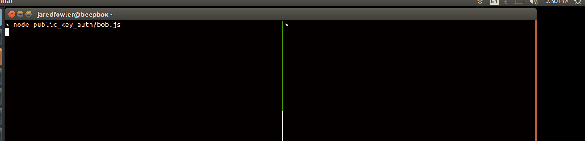

# public key auth chat
p2p fun with sodium-friends'
[sodium-native](https://github.com/sodium-friends/sodium-native):

## Running public key auth
Connects two clients and send encrypted messages after exchanging keys. To run it open two terminal windows.

In one do:
```bash
$ node public_key_auth/bob.js
```

and the other do:
```bash
$ node public_key_auth/alice.js
```

the two programs will connect and exchange public keys. After that, typing into
the `alice.js` window will encrypt the message with Bob's *public* key and
Alices's *private* key. And vice versa, typing into the `bob.js` window will
encrpyt with Alice's *public* key and Bob's *private* key.

here's a demo:


## Running secret box
sends a one time encrypted message from client to server.
To run it, open two terminal windows.

In one do:

```bash
$ node secret_box/server.js
```

and the other do:
```bash
$ node secret_box/client.js <some message to send here>
```
The secret message is passed as an argument on the command line (which _might_
not be the most secure way of sending secret messages :eyes:)
so anything you write after `secret_box/client.js` will be encrypted
and sent to the terminal running `server.js`.


# License
MIT
